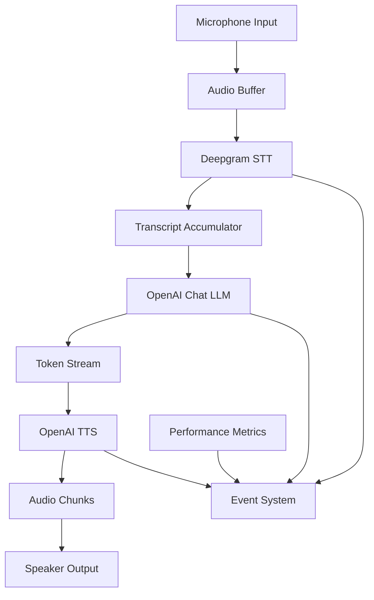

# Technical Architecture

## System Overview

The Voice Node Library implements a real-time, streaming voice conversation system using a pipeline architecture that optimizes for low latency and high responsiveness.

## Data Flow Architecture



## Core Design Patterns

### 1. Provider Pattern
All external services (STT, LLM, TTS) implement standardized interfaces, enabling:
- Easy service swapping
- Consistent error handling
- Uniform streaming protocols

### 2. Event-Driven Architecture
The system uses EventEmitter3 for loose coupling:
- Components communicate via events
- Enables real-time monitoring
- Facilitates debugging and metrics collection

### 3. Intelligent Text Optimization
Speech-friendly response generation via system prompts:
- LLM generates conversational text optimized for TTS
- No post-processing required for formatting removal
- Natural speech patterns and transitions built-in

### 4. Streaming Pipeline
End-to-end streaming minimizes latency:
- Audio → STT: Real-time transcription
- STT → LLM: Immediate text processing
- LLM → TTS: Token-by-token synthesis
- TTS → Audio: Chunk-based playback

## Performance Optimizations

### Latency Reduction
1. **Interim Results**: STT interim results are accumulated for longer prompts
2. **Token Streaming**: LLM tokens flow directly to TTS without buffering
3. **Chunk Synthesis**: TTS processes text in sentence-boundary chunks
4. **Parallel Audio**: Audio playback starts immediately upon first chunk
5. **Smart Text Generation**: System prompts eliminate need for post-processing

### Memory Management
1. **Streaming Buffers**: Fixed-size buffers prevent memory leaks
2. **Temporary Files**: Audio chunks written to temp files, auto-cleaned
3. **Event Cleanup**: Event listeners properly removed on completion

### Error Recovery
1. **Connection Resilience**: Automatic reconnection for dropped connections
2. **Graceful Degradation**: Partial failures don't crash the pipeline
3. **Timeout Handling**: Prevents hanging on unresponsive services

## Audio Processing Pipeline

### Input Chain
```
Microphone (48kHz) → Buffer → Deepgram Live API → Transcript Chunks
```

### Output Chain
```
Text Tokens → OpenAI TTS → PCM (24kHz) → SoX Conversion → afplay
```

### Audio Format Transformations
1. **Input**: 48kHz, 16-bit, mono, signed integer
2. **Processing**: Real-time streaming, no buffering
3. **Output**: 24kHz, 16-bit, mono PCM
4. **Playback**: WAV conversion via SoX, sequential chunk playback

## Concurrency Model

### Async/Await with Generators
- STT: `AsyncIterable<TranscriptChunk>`
- LLM: `AsyncIterable<TokenChunk>`
- TTS: `AsyncIterable<AudioChunk>`

### Background Processing
- Audio input feeding runs in background task
- Audio output playback queue operates independently
- Main thread handles coordination and events

## Configuration Architecture

### Provider Configuration
Each provider supports constructor-based configuration:
```typescript
new DeepgramSTT("nova-3", { endpointing: 2000 })
new OpenAIChat("gpt-4o-mini", { temperature: 0.7 })
new OpenAITTS("tts-1", { voice: "alloy" })
```

### Environment-Based Setup
Runtime configuration via environment variables:
- API keys
- Model selections
- Feature flags

## Monitoring and Observability

### Metrics Collection
Prometheus-compatible metrics:
- STT latency distribution
- LLM first token time
- End-to-end response time
- Error rates by component

### Event Tracing
Comprehensive event system:
- `sttChunk`: Transcription progress
- `llmToken`: Language model streaming
- `audioChunk`: Audio synthesis output
- `metrics`: Performance measurements

## Security Considerations

### API Key Management
- Environment variable injection
- No hardcoded credentials
- Runtime validation of required keys

### Audio Data Handling
- Temporary files cleaned automatically
- No persistent audio storage
- Memory buffers cleared after use

## Scalability Patterns

### Horizontal Scaling
- Stateless provider implementations
- No shared state between instances
- Independent conversation sessions

### Resource Management
- Controlled memory usage via streaming
- CPU-efficient audio processing
- Network bandwidth optimization

## Testing Strategy

### Unit Testing
- Provider interface compliance
- Audio format validation
- Error handling verification

### Integration Testing
- End-to-end pipeline testing
- Real API service validation
- Performance benchmarking

### System Testing
- Real-time conversation scenarios
- Stress testing with extended sessions
- Network failure simulation

## Deployment Considerations

### Runtime Dependencies
- Node.js 18+ for modern JavaScript features
- SoX for audio format conversion
- macOS-specific audio playback (afplay)

### Resource Requirements
- CPU: Moderate for audio processing
- Memory: ~100MB for typical session
- Network: Continuous connection to APIs
- Storage: Minimal (temporary files only)

## Future Architecture Extensions

### Multi-Platform Audio
- Abstract audio I/O layer
- Platform-specific implementations
- WebRTC support for browser usage

### Provider Ecosystem
- Plugin architecture for custom providers
- Provider marketplace/registry
- Dynamic provider loading

### Advanced Features
- Multi-speaker support
- Language detection/switching
- Voice activity detection
- Conversation state persistence 